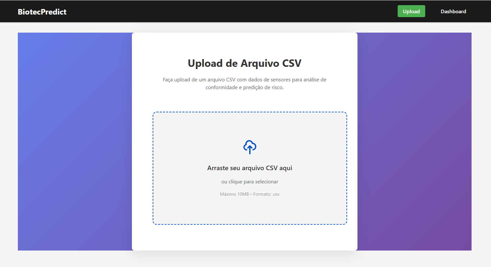
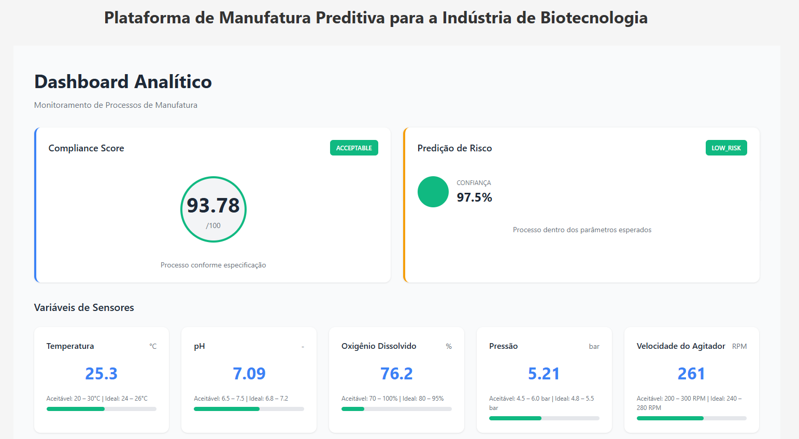
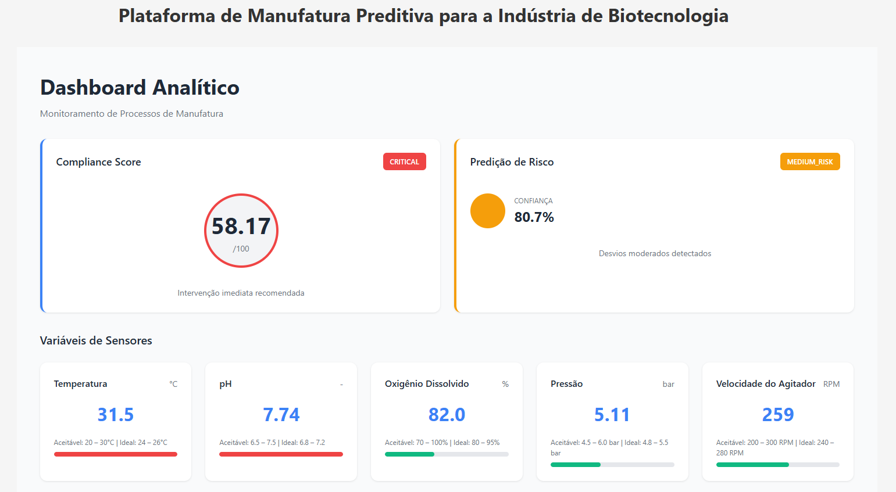
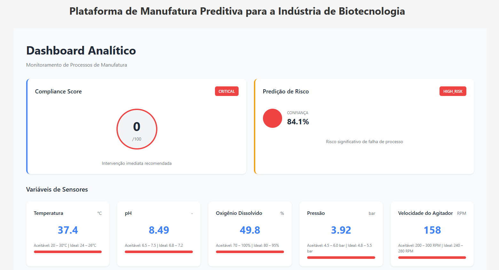
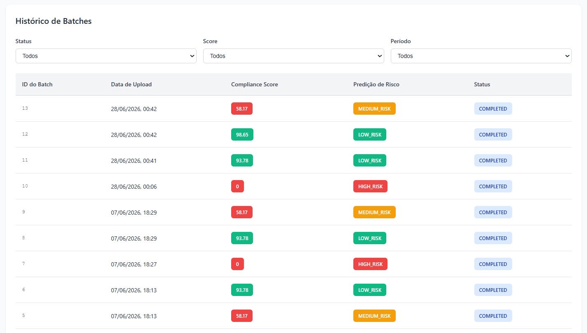

# BiotecPredict

**Plataforma de Manufatura Preditiva para a Indústria de Biotecnologia**

**Desenvolvido por:** [Michele Oliveira](https://github.com/micheleoliveiracod)

**Organização:** Programa SCTEC e SENAI (https://github.com/IA-para-DEVs-SCTEC-T2)

**Curso:** IA para DEVs

**Objetivo:** Desenvolvimento de um mini projeto E2E com IA em todas as etapas, como entrega final do módulo 1.

---

## 📋 Índice de Requisitos de Entrega

Este README está estruturado conforme os 10 requisitos de entrega do projeto avaliativo:

1. [Nome do Projeto e Problema Resolvido](#m01--nome-do-projeto-e-problema-resolvido)
2. [Ferramentas de IA Utilizadas](#m02--ferramentas-de-ia-utilizadas)
3. [Padrões de Prompting Aplicados](#m03--padrões-de-prompting-aplicados)
4. [Diagrama ou Descrição da Arquitetura](#m04--diagrama-ou-descrição-da-arquitetura)
5. [Instruções Completas de Instalação e Execução](#m05--instruções-completas-de-instalação-e-execução)
6. [Cenários de Uso com Exemplos](#m06--cenários-de-uso-com-exemplos)
7. [Caso Documentado de Saída Incorreta da IA](#m07--caso-documentado-de-saída-incorreta-da-ia)
8. [Melhorias Futuras](#m08--melhorias-futuras)
9. [Link do Vídeo no YouTube](#m09--link-do-vídeo-no-youtube)
10. [LICENSE](#m10--license)

---

## M01 — Nome do Projeto e Problema Resolvido

### ✅ Nome do Projeto

**BiotecPredict** - Plataforma de Manufatura Preditiva para a Indústria de Biotecnologia

### ✅ Problema Resolvido

Operadores de manufatura biofarmacêutica enfrentam desafios críticos:

- **Dificuldade em monitorar múltiplas variáveis de processo simultaneamente** - Sensores geram dados contínuos que são difíceis de analisar manualmente
- **Falta de alertas automáticos para desvios de especificação** - Desvios são detectados tardiamente, causando perda de lotes
- **Análise manual demorada de dados de sensores** - Operadores gastam horas analisando dados históricos
- **Impossibilidade de prever falhas antes que ocorram** - Sem previsão, não há tempo para ação corretiva
- **Falta de rastreabilidade completa de decisões** - Difícil auditar e conformar com regulamentações

### ✅ Solução Implementada

BiotecPredict é uma plataforma SaaS end-to-end que:

- ✅ **Consolida dados de múltiplos sensores industriais** em um único dashboard
- ✅ **Aplica regras determinísticas** para cálculo de Manufacturing Compliance Score (0-100)
- ✅ **Utiliza machine learning** (RandomForestClassifier) para predição de risco
- ✅ **Gera alertas automáticos** para desvios de especificação
- ✅ **Fornece dashboard intuitivo** com visualizações em tempo real
- ✅ **Mantém histórico completo** para auditoria e conformidade regulatória

**Domínio de referência:** [Big Data – Biopharmaceutical Manufacturing (Kaggle)](https://www.kaggle.com/datasets/stephengoldie/big-databiopharmaceutical-manufacturing)

---

## M02 — Ferramentas de IA Utilizadas

### 🤖 Ferramentas de IA no Projeto

O BiotecPredict foi desenvolvido com suporte completo de IA em todas as etapas do projeto, utilizando as seguintes ferramentas:

#### 1. **Kiro - IDE com IA Integrada**

**O que é:** Ambiente de desenvolvimento integrado (IDE) que funciona como um agente autônomo de IA para desenvolvimento de software.

**Modelo de IA:** Claude Haiku 4.5 (modelo otimizado para velocidade e eficiência)

**Etapas de Uso:**

| Etapa | Uso de IA | Descrição |
|-------|-----------|-----------|
| **Planejamento** | Análise de requisitos | Kiro analisa requisitos e sugere arquitetura |
| **Design** | Geração de arquitetura | Kiro gera diagramas e estrutura de projeto |
| **Implementação** | Geração de código | Kiro escreve código backend (Python/FastAPI) e frontend (React/TypeScript) |
| **Testes** | Geração de testes | Kiro gera testes unitários (pytest, Vitest) e E2E (Cypress) |
| **Documentação** | Geração automática | Kiro gera docstrings, README, API docs (Swagger) |
| **CI/CD** | Automação de workflows | Kiro configura GitHub Actions para lint, testes, deploy |
| **Validação** | Análise de qualidade | Kiro valida código, testes, cobertura |
| **Rastreabilidade** | Logging de prompts | Kiro registra todos os prompts em `.kiro/prompt-logs/` |

#### 2. **Claude Code - Agente de Engenharia de Software**

**O que é:** CLI e agente autônomo da Anthropic que opera diretamente no terminal/IDE, com acesso completo ao sistema de arquivos, git e ferramentas de desenvolvimento.

**Modelo de IA:** Claude Sonnet 4.6 (modelo avançado para engenharia de software)

**Etapas de Uso:**

| Etapa | Uso de IA | Descrição |
|-------|-----------|-----------|
| **Implementação** | Geração e refatoração de código | Claude Code edita, cria e refatora código com contexto completo do projeto |
| **Debugging** | Análise e correção de bugs | Claude Code identifica root causes e aplica correções |
| **Testes** | Geração e execução de testes | Claude Code gera testes e valida resultados |
| **Code Review** | Revisão de código | Claude Code analisa diffs, identifica bugs e sugere melhorias |
| **Documentação** | Geração e atualização de docs | Claude Code gera e mantém README, docstrings e documentação técnica |
| **Git** | Gerenciamento de versionamento | Claude Code cria commits, branches e PRs |

**Capacidades Utilizadas:**
- ✅ Edição multi-arquivo com contexto completo do codebase
- ✅ Execução de comandos shell (build, testes, lint)
- ✅ Análise e correção de bugs em tempo real
- ✅ Code review automatizado com diferentes níveis de profundidade
- ✅ Gerenciamento de git (commits, branches, PRs)
- ✅ Integração com MCP servers (Figma, Notion, etc.)

#### 3. **Claude Haiku 4.5 - Modelo de IA**

**Características:**
- Modelo otimizado para velocidade e eficiência
- Suporta contexto de até 200K tokens
- Ideal para tarefas de desenvolvimento de software
- Integrado ao Kiro para execução autônoma

**Capacidades Utilizadas:**
- ✅ Análise de código e requisitos
- ✅ Geração de código Python e TypeScript
- ✅ Geração de testes automatizados
- ✅ Geração de documentação técnica
- ✅ Análise crítica de qualidade
- ✅ Sugestões de otimização

#### 4. **GitHub Actions - Automação com IA**

**Workflows com Suporte de IA:**

| Workflow | Função | IA Utilizada |
|----------|--------|--------------|
| **CI - Lint & Tests** | Validação automática de código | Kiro gera testes, GitHub Actions executa |
| **CD - Deploy** | Deploy automático em produção | Kiro configura, GitHub Actions executa |
| **Docs Generation** | Geração automática de documentação | Kiro gera docs, GitHub Actions publica |
| **AI Test Generation** | Geração de testes com IA | Kiro gera testes, GitHub Actions valida |
| **Project Automation** | Automação de board do projeto | Kiro configura, GitHub Actions gerencia |

#### 5. **Hooks do Kiro - Automação de Eventos**

**Hooks Implementados:**

| Hook | Evento | Ação | Propósito |
|------|--------|------|----------|
| **prompt-logger.json** | `promptSubmit` | Registra prompts | Rastreabilidade de interações com IA |
| **generate-tests.json** | `postToolUse` | Gera testes | Testes automáticos para código novo |
| **generate-docs.json** | `postToolUse` | Gera documentação | Documentação automática |

---

## M03 — Padrões de Prompting Aplicados

### 📝 Padrões de Prompting Utilizados

O projeto utiliza diversos padrões de prompting para otimizar a qualidade do código gerado pela IA:

#### 1. **Chain-of-Thought (CoT) - Raciocínio Passo a Passo**

Solicitar que a IA explique seu raciocínio passo a passo antes de gerar código.

**Aplicação:** Implementação de compliance score engine, pipeline ML, geração de testes complexos

#### 2. **Few-Shot Learning - Exemplos de Referência**

Fornecer exemplos de código bem-estruturado para que a IA siga o padrão.

**Aplicação:** Geração de endpoints REST, componentes React, testes unitários

#### 3. **Role-Based Prompting - Assumir Papel**

Solicitar que a IA assuma um papel específico (arquiteto, desenvolvedor, testador, etc.).

**Aplicação:** Análise de arquitetura, revisão de código, análise crítica de qualidade

#### 4. **Constraint-Based Prompting - Restrições Explícitas**

Especificar restrições e requisitos explícitos para o código gerado.

**Aplicação:** Validação de dados, geração de schemas Pydantic, geração de testes com cobertura

#### 5. **Iterative Refinement - Refinamento Iterativo**

Solicitar melhorias incrementais ao código gerado.

**Aplicação:** Desenvolvimento iterativo de features, melhorias incrementais de código, adição de testes

#### 6. **Context-Aware Prompting - Contexto Explícito**

Fornecer contexto completo sobre o projeto, arquitetura e padrões.

**Aplicação:** Geração de código consistente, integração com arquitetura existente, padrões padronizados

#### 7. **Error-Driven Prompting - Baseado em Erros**

Usar erros como feedback para melhorar o código.

**Aplicação:** Correção de bugs, melhoria de robustez, tratamento de edge cases

---

## M04 — Diagrama ou Descrição da Arquitetura

### 🏗️ Arquitetura do Sistema

#### Diagrama de Fluxo de Dados

```
┌─────────────────────────────────────────────────────────────────┐
│                     BIOTECPREDICT ARCHITECTURE                  │
└─────────────────────────────────────────────────────────────────┘

┌──────────────────────────────────────────────────────────────────┐
│                        FRONTEND (React)                          │
│  ┌─────────────┐  ┌──────────────┐  ┌──────────────────────┐   │
│  │ Upload Page │  │  Dashboard   │  │  Analytics Page      │   │
│  └──────┬──────┘  └──────┬───────┘  └──────────┬───────────┘   │
│         │                │                     │                │
│         └────────────────┼─────────────────────┘                │
│                          │                                      │
│                    Axios HTTP Client                            │
└──────────────────────────┼──────────────────────────────────────┘
                           │
                    ┌──────▼──────┐
                    │  REST API   │
                    │  (FastAPI)  │
                    └──────┬──────┘
                           │
        ┌──────────────────┼──────────────────┐
        │                  │                  │
   ┌────▼────┐      ┌─────▼──────┐    ┌─────▼──────┐
   │ Upload  │      │  Compliance│    │ Prediction │
   │ Endpoint│      │  Endpoint  │    │ Endpoint   │
   └────┬────┘      └─────┬──────┘    └─────┬──────┘
        │                 │                 │
        └─────────────────┼─────────────────┘
                          │
        ┌─────────────────┼─────────────────┐
        │                 │                 │
   ┌────▼────────┐  ┌────▼────────┐  ┌────▼────────┐
   │ Processors  │  │  Services   │  │ ML Pipeline │
   │ (CSV, Data) │  │ (Business   │  │ (RandomFor- │
   │             │  │  Logic)     │  │  est)       │
   └────┬────────┘  └────┬────────┘  └────┬────────┘
        │                │                │
        └────────────────┼────────────────┘
                         │
                    ┌────▼────────┐
                    │   SQLite    │
                    │  Database   │
                    └─────────────┘
```

#### Stack Tecnológica

**Backend:** Python 3.11+ | FastAPI 0.100+ | SQLAlchemy 2.0+ | SQLite 3.x

**Frontend:** React 18+ | TypeScript 5.0+ | Vite 5.0+ | TailwindCSS 3.0+

**DevOps:** Docker 24.0+ | Docker Compose 2.20+ | GitHub Actions

---

## M05 — Instruções Completas de Instalação e Execução

### 📋 Pré-requisitos

- **Docker Desktop** (versão 24.0+) - [Download](https://www.docker.com/products/docker-desktop)
- **Git** (versão 2.30+) - [Download](https://git-scm.com/)
- **RAM**: Mínimo 4GB disponível
- **Espaço em disco**: Mínimo 2GB livres

### 🚀 Início Rápido (3 Passos)

#### Passo 1: Clone o repositório

```bash
git clone https://github.com/micheleoliveiracod/Projeto-avaliativo-M1-2-BiotecPredict.git
cd Projeto-avaliativo-M1-2-BiotecPredict
```

#### Passo 2: Configure variáveis de ambiente

```bash
cp .env.example .env
```

#### Passo 3: Inicie o sistema

**Windows (CMD):**
```cmd
cd deploy
start.bat
```

**Mac/Linux:**
```bash
cd deploy
chmod +x start.sh
./start.sh
```

### 🌐 Acesse a Aplicação

Aguarde 20-30 segundos, depois acesse:

| Serviço | URL |
|---------|-----|
| **Frontend** | http://localhost |
| **API** | http://localhost:8000/api |
| **Swagger** | http://localhost:8000/docs |
| **ReDoc** | http://localhost:8000/redoc |

---

## 📸 Sistema em Funcionamento

### Upload de CSV

**Tela de upload — envio do arquivo CSV com as leituras do batch:**



### Dashboard — Análise de Risco por Batch

**Low Risk — Batch dentro das especificações:**



**Medium Risk — Batch com desvios moderados:**



**High Risk — Batch com desvios críticos:**



### Histórico de Batches



---

## M06 — Cenários de Uso com Exemplos

### 📊 Cenário 1: Upload e Processamento de Batch

**Objetivo:** Fazer upload de um arquivo CSV com dados de sensores e obter análise de compliance.

**Passos:**

1. Acesse http://localhost
2. Clique em "Upload CSV"
3. Selecione um arquivo CSV com dados de sensores
4. Clique em "Processar"
5. Visualize o Manufacturing Compliance Score

**Exemplo de CSV:**

```csv
batch_id,timestamp,temperature,ph,dissolved_oxygen,pressure,agitator_speed
BATCH001,2026-05-30T10:00:00,25.5,7.2,85.0,5.2,250
BATCH001,2026-05-30T10:15:00,26.0,7.1,84.5,5.3,255
BATCH001,2026-05-30T10:30:00,25.8,7.3,86.0,5.1,248
```

**Resultado Esperado:**

```json
{
  "batch_id": "BATCH001",
  "compliance_score": 85,
  "classification": "ACCEPTABLE",
  "risk_prediction": "LOW RISK",
  "confidence": 0.92
}
```

### 📈 Cenário 2: Consultar Histórico de Batches

**Objetivo:** Visualizar todos os batches processados e seus scores.

**Endpoint:**

```bash
GET http://localhost:8000/api/v1/batches
```

**Resposta:**

```json
{
  "batches": [
    {
      "id": "BATCH001",
      "upload_date": "2026-05-30T10:00:00",
      "compliance_score": 85,
      "classification": "ACCEPTABLE",
      "risk_prediction": "LOW RISK"
    },
    {
      "id": "BATCH002",
      "upload_date": "2026-05-30T11:00:00",
      "compliance_score": 65,
      "classification": "WARNING",
      "risk_prediction": "MEDIUM RISK"
    }
  ]
}
```

### � Cenário 3: Analisar Detalhes de um Batch

**Objetivo:** Obter análise detalhada de um batch específico.

**Endpoint:**

```bash
GET http://localhost:8000/api/v1/batch/BATCH001
```

**Resposta:**

```json
{
  "batch_id": "BATCH001",
  "upload_date": "2026-05-30T10:00:00",
  "sensor_readings": [
    {
      "timestamp": "2026-05-30T10:00:00",
      "temperature": 25.5,
      "ph": 7.2,
      "dissolved_oxygen": 85.0,
      "pressure": 5.2,
      "agitator_speed": 250
    }
  ],
  "compliance_score": 85,
  "risk_prediction": "LOW RISK"
}
```

---

## M07 — Caso Documentado de Saída Incorreta da IA

### ⚠️ Casos Reais Documentados

A IA (Claude Sonnet 4.6) gerou código com erros lógicos em três pontos do sistema durante o desenvolvimento. Os casos estão totalmente documentados em [docs/m07-saida-incorreta-ia.md](docs/m07-saida-incorreta-ia.md).

#### Resumo dos Casos

| Caso | Módulo | Erro da IA | Impacto |
|------|--------|-----------|---------|
| 1 | `compliance_service.py` | Penalidade dupla no cálculo do score + threshold errado | Batches `WARNING` classificados como `CRITICAL` |
| 2 | `ml/model.py` | Dataset de treino sem classe `MEDIUM RISK` + ranges de sensores estreitos | Modelo nunca previa risco médio |
| 3 | `Dashboard.tsx` | Ranges dos indicadores visuais divergiam do backend | Dashboard mostrava verde para sensores fora do spec |

**Commit de correção:** `f87c41e`

**Documentação completa:** [docs/m07-saida-incorreta-ia.md](docs/m07-saida-incorreta-ia.md)

---

## M08 — Melhorias Futuras

### 🚀 Roadmap de Melhorias

#### Fase 2: Integração em Tempo Real
- [ ] Integração com sistemas SCADA
- [ ] Dados em tempo real (não apenas batch)
- [ ] Alertas por email/SMS
- [ ] Dashboard em tempo real

#### Fase 3: Modelos Avançados
- [ ] Detecção de anomalias com Isolation Forest
- [ ] Forecasting temporal com ARIMA/Prophet
- [ ] Modelos avançados (XGBoost, Neural Networks)
- [ ] Análise de causa raiz de falhas

#### Fase 4: Escalabilidade
- [ ] Suporte a 1000+ usuários simultâneos
- [ ] Arquitetura de microserviços
- [ ] Cache distribuído (Redis)
- [ ] Message queue (RabbitMQ/Kafka)

#### Fase 5: Conformidade
- [ ] Autenticação e autorização (OAuth2)
- [ ] Criptografia de dados em repouso
- [ ] Conformidade GDPR/HIPAA
- [ ] Auditoria completa de operações

---

## M09 — Link do Vídeo no YouTube

### 🎬 Apresentação do Projeto

**Status:** ✅ Publicado

**Link:** [Assista a apresentação completa do BiotecPredict no YouTube](https://youtu.be/9Pax-hNaamo)

**Conteúdo do Vídeo:**
- Demonstração da plataforma
- Explicação da arquitetura
- Análise crítica de uso de IA
- Resultados e métricas

---

## M10 — LICENSE

### 📄 Licença do Projeto

Este projeto está licenciado sob a **Apache License 2.0**.

## 🤝 Contribuindo

1. Crie uma branch para sua feature: `git checkout -b feature/sua-feature`
2. Commit suas mudanças: `git commit -m 'feat: descrição da feature'`
3. Push para a branch: `git push origin feature/sua-feature`
4. Abra um Pull Request

Consulte [GitFlow](.specs/gitflow.md) para mais detalhes.

---

## ✅ Checklist Final de Entrega

### Requisitos Obrigatórios do Projeto Avaliativo

| # | Requisito | Status | Observação |
|---|-----------|--------|------------|
| M01 | Nome do projeto e problema resolvido | ✅ Completo | Documentado no README |
| M02 | Ferramentas de IA utilizadas | ✅ Completo | Kiro + Claude Code documentados |
| M03 | Padrões de prompting aplicados | ✅ Completo | 7 padrões documentados |
| M04 | Diagrama ou descrição da arquitetura | ✅ Completo | ASCII diagram + stack tecnológica |
| M05 | Instruções completas de instalação e execução | ✅ Completo | Docker em 3 passos |
| M06 | Cenários de uso com exemplos | ✅ Completo | 3 cenários com exemplos reais |
| M07 | Caso documentado de saída incorreta da IA | ✅ Completo | 3 casos reais documentados em [docs/m07-saida-incorreta-ia.md](docs/m07-saida-incorreta-ia.md) |
| M08 | Melhorias futuras | ✅ Completo | Roadmap em 4 fases |
| M09 | Link do vídeo no YouTube | ✅ Completo | https://youtu.be/9Pax-hNaamo |
| M10 | LICENSE | ✅ Completo | Apache License 2.0 |

### Pendências Técnicas

| Item | Status | Ação Necessária |
|------|--------|-----------------|
| Branch `docs/docs-prompts-deploy` → `main` | ✅ Concluído | Abrir PR e fazer merge final |
| Seção M07 (saída incorreta da IA) | ✅ Concluído | 3 casos reais documentados em docs/m07-saida-incorreta-ia.md |
| Email do desenvolvedor no README | ✅ Concluído | data.analystmlso@gmail.com |
| Arquivo `.env.example` | ✅ Presente | Verificar se está completo antes do merge |
| `biotecpredict.db` no `.gitignore` | ✅ Concluído | Regra `*.db` adicionada ao .gitignore |

---

## 📚 Documentação Adicional

- [Documentação Técnica](docs/README.md)
- [Guia de Desenvolvimento](docs/DEVELOPMENT.md)
- [API Documentation](http://localhost:8000/docs)
- [Steering Files](.specs/)

---

## ⭐ Agradecimentos

- **SCTEC e SENAI** - Programa de IA para DEVs
- **Kaggle** - Dataset de Biopharmaceutical Manufacturing
- **Comunidade Open Source** - Ferramentas e bibliotecas utilizadas

## 👨‍💻 Desenvolvedor

**Desenvolvido com 💜 por Michele Oliveira**
- GitHub: [@micheleoliveiracod](https://github.com/micheleoliveiracod)
- Email: [data.analystmlso@gmail.com](mailto:data.analystmlso@gmail.com)

**Última atualização:**  13 de Julho de 2026

**Status do Projeto:** ✅ MVP Concluído | ✅ Merge final em main concluído