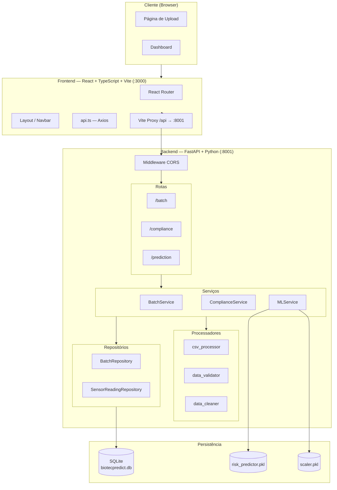
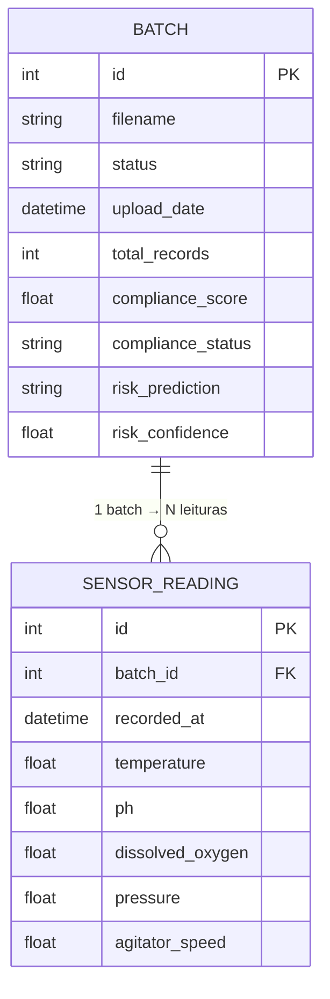
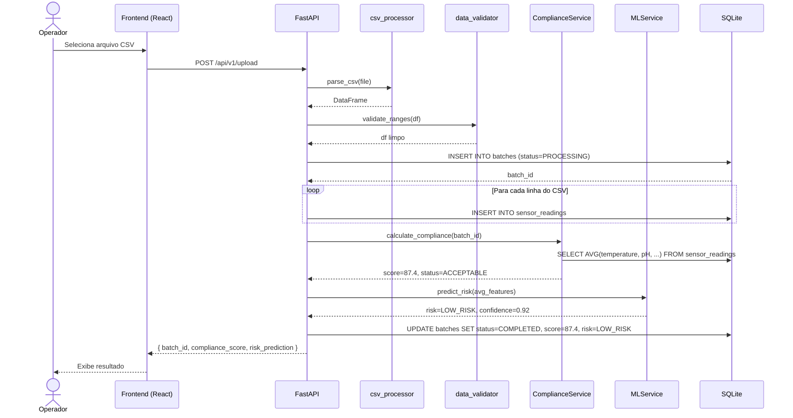
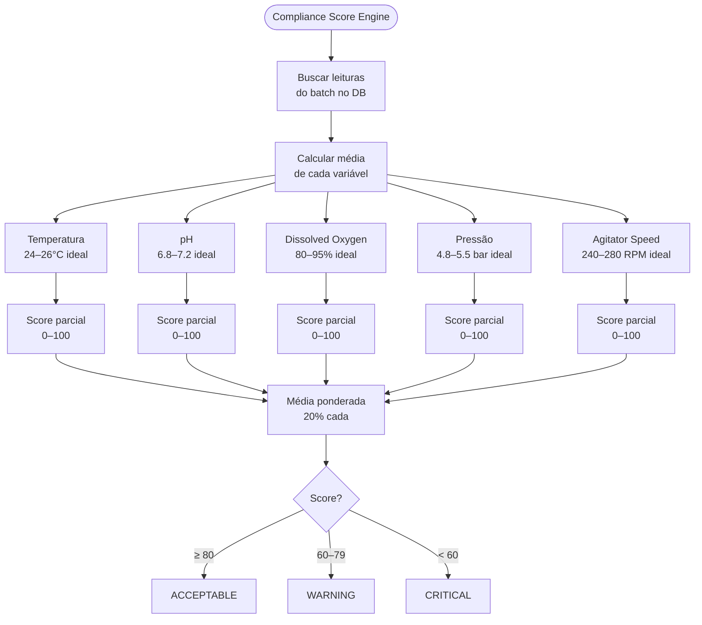
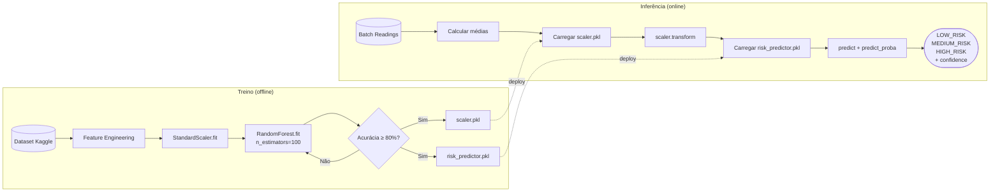
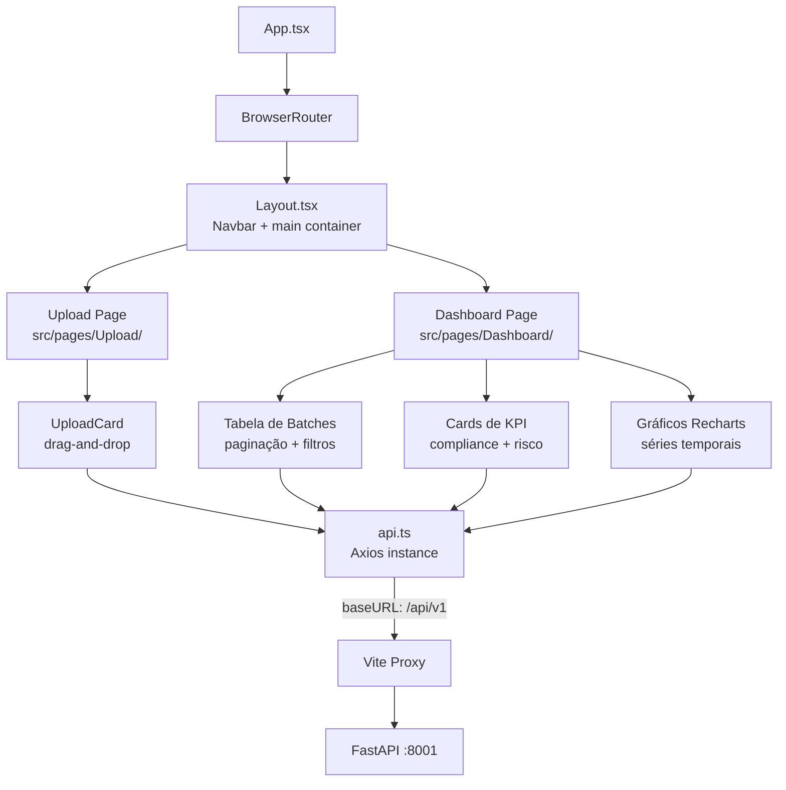
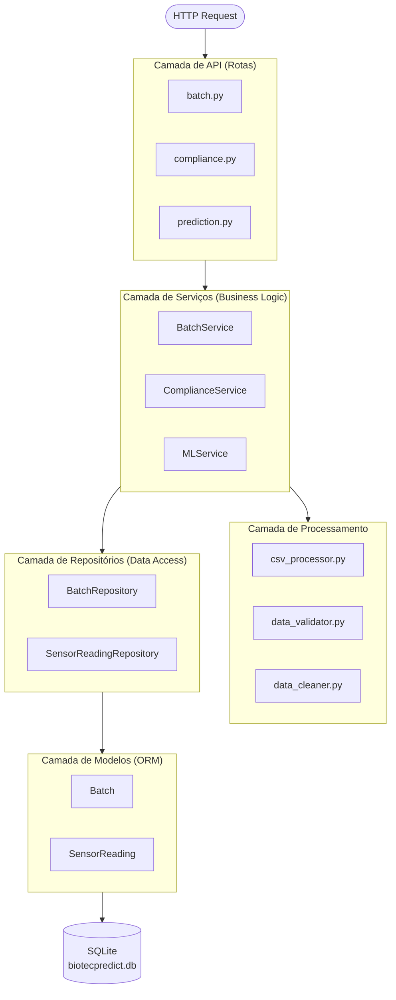
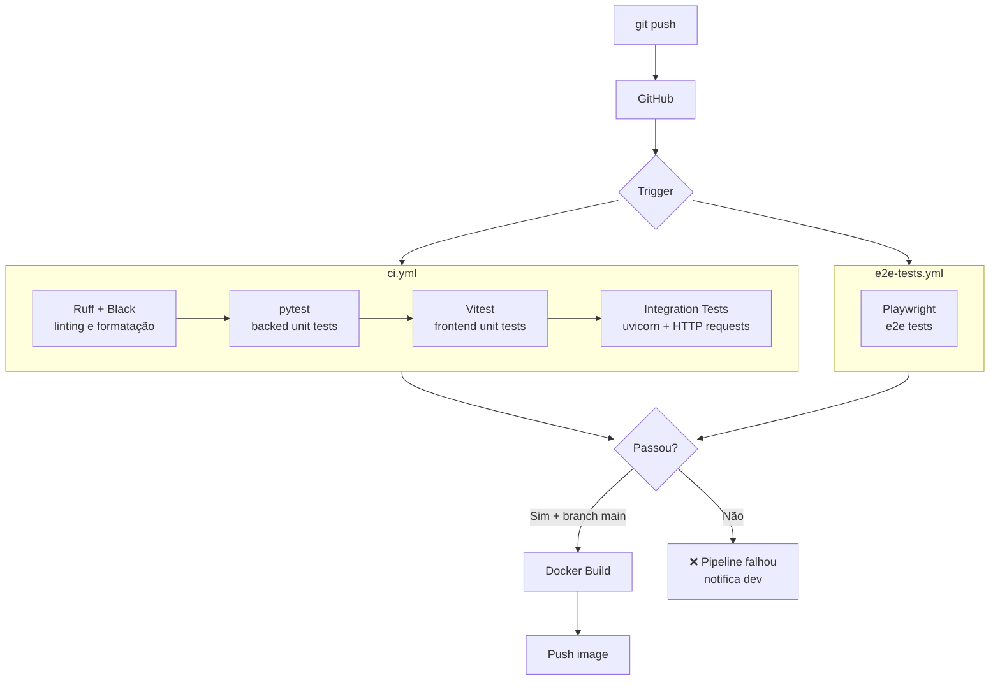
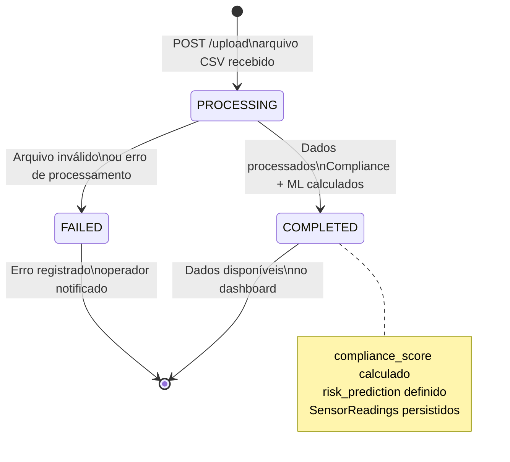

# Diagramas — BiotecPredict

Diagramas técnicos do projeto BiotecPredict em formato Mermaid (renderizáveis no GitHub e VSCode).

---

## 1. Arquitetura Geral do Sistema

---

## 2. Diagrama de Entidade-Relacionamento (ER)

---

## 3. Fluxo de Upload de CSV (Sequência)

---

## 4. Fluxo de Cálculo do Compliance Score

---

## 5. Pipeline de Machine Learning

---

## 6. Diagrama de Componentes — Frontend

---

## 7. Diagrama de Camadas — Backend (Clean Architecture)

---

## 8. Pipeline de CI/CD (GitHub Actions)

---

## 9. Estados de um Batch

---