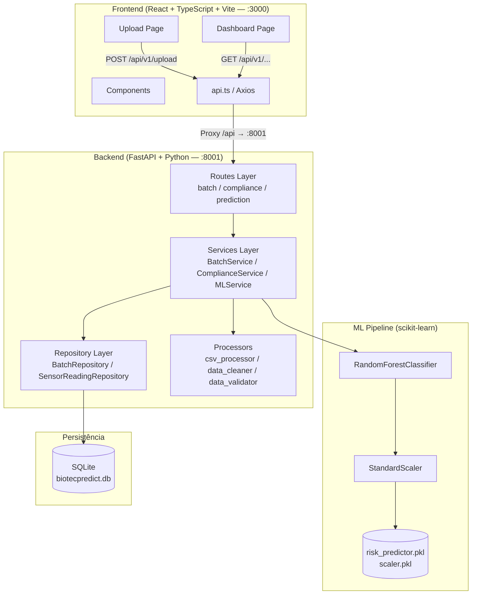
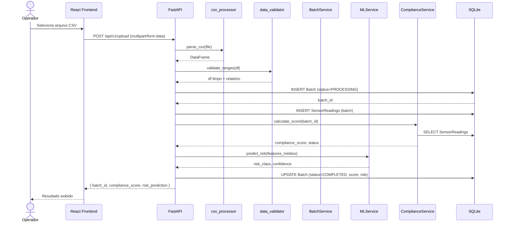
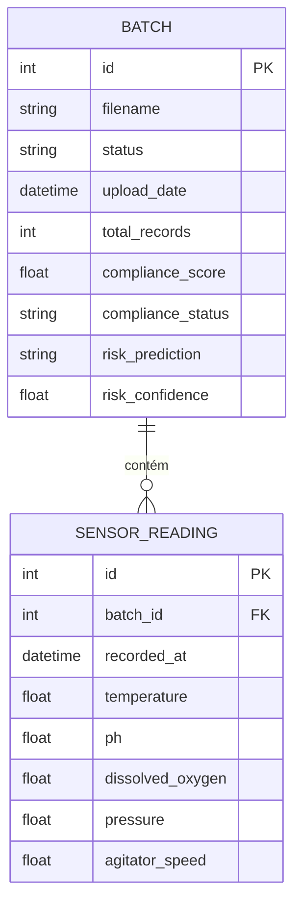
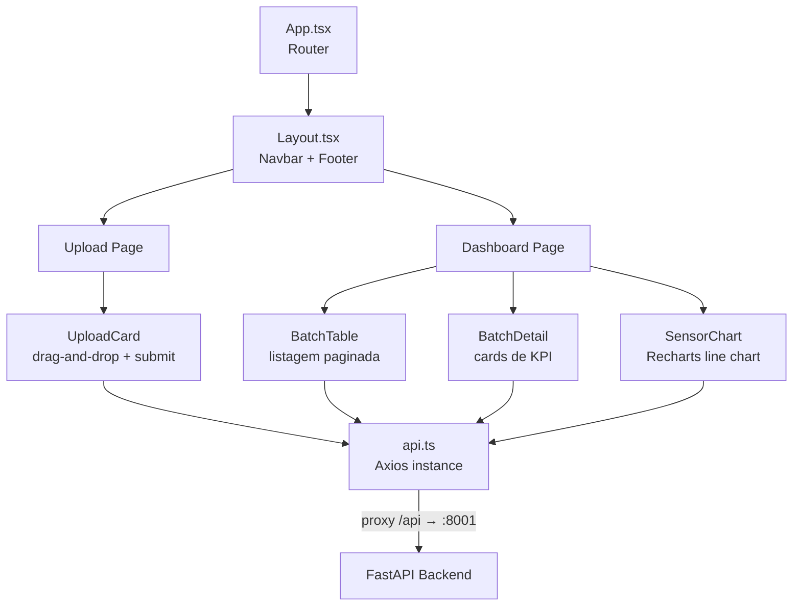
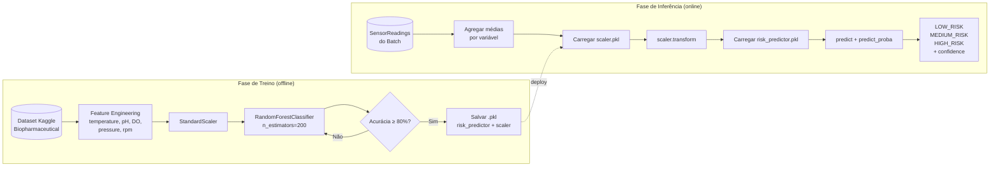
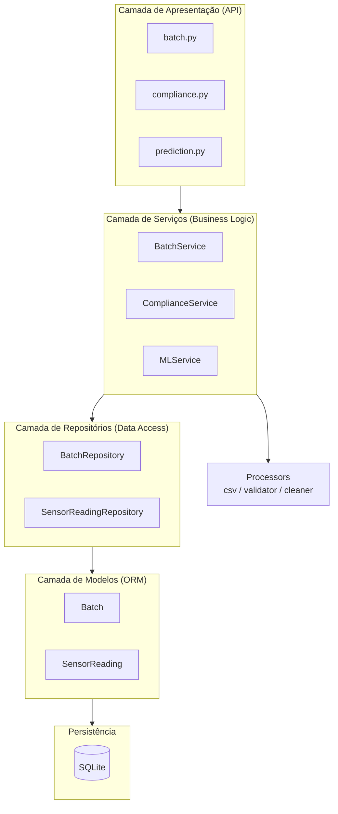
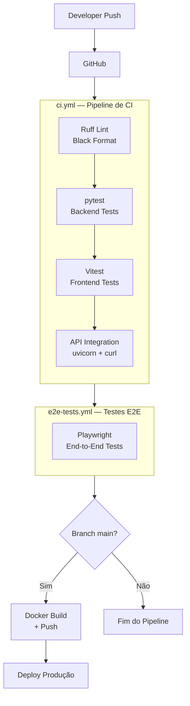

# PRD — BiotecPredict
## Plataforma de Manufatura Preditiva

**Versão**: 1.0.0  
**Data**: Maio de 2026  
**Autora**: Michele Oliveira  
**Status**: Em desenvolvimento (MVP)

---

## 1. Resumo Executivo

BiotecPredict é uma plataforma web para análise preditiva de qualidade em manufatura biofarmacêutica. A plataforma recebe dados de sensores industriais via upload de CSV, calcula um score de conformidade de processo e aplica um modelo de Machine Learning para predizer o risco de falha do batch — entregando ao operador um parecer confiável em menos de 5 segundos.

---

## 2. Problema

Processos de fabricação biofarmacêutica (biorreatores, fermentadores) geram grandes volumes de dados de sensores. A análise manual desses dados é:

- **Lenta**: engenheiros revisam planilhas manualmente após o fim do batch
- **Subjetiva**: não há critério padronizado para classificar risco
- **Reativa**: problemas são detectados tarde, após perda de produto

O impacto financeiro de um batch rejeitado varia de dezenas a centenas de milhares de reais, além do risco regulatório (GMP, FDA, ANVISA).

---

## 3. Solução

Uma aplicação web que:

1. **Aceita upload de CSV** com dados de sensores do batch
2. **Valida e limpa** os dados automaticamente
3. **Calcula o Compliance Score** por regras determinísticas de processo
4. **Prediz o risco do batch** com RandomForestClassifier
5. **Exibe resultados** em dashboard visual com KPIs e gráficos

---

## 4. Stakeholders

| Papel | Descrição | Necessidade Principal |
|---|---|---|
| Operador de Manufatura | Faz upload dos dados do turno | Saber rapidamente se o batch está OK |
| Engenheiro de Qualidade | Analisa conformidade de processo | Score detalhado + rastreabilidade |
| Gestor de Produção | Acompanha performance geral | Dashboard agregado de batches |
| Cientista de Dados | Mantém o modelo ML | Métricas de acurácia e deriva do modelo |

---

## 5. Escopo do MVP

### Incluído

- Upload de arquivo CSV com dados de sensores
- Processamento, validação e limpeza de dados
- Cálculo de Manufacturing Compliance Score
- Predição de risco com RandomForest (LOW/MEDIUM/HIGH RISK)
- Dashboard com listagem de batches e detalhes
- API REST documentada (Swagger)
- Testes automatizados (pytest + Vitest)
- CI/CD com GitHub Actions

### Fora do Escopo (V2)

- Autenticação de usuários
- Alertas em tempo real (WebSocket)
- Integração direta com equipamentos (OPC-UA, SCADA)
- Relatórios em PDF
- Modelo customizável por usuário

---

## 6. Requisitos Funcionais

### F01 — Upload de CSV

- **Ator**: Operador
- **Descrição**: O usuário faz upload de um arquivo CSV contendo dados de sensores do batch
- **Critérios de aceitação**:
  - Aceita somente arquivos `.csv`
  - Valida presença das colunas obrigatórias: `temperature`, `pH`, `dissolved_oxygen`, `pressure`, `agitator_speed`
  - Rejeita arquivo com mensagem de erro se formato inválido
  - Retorna `batch_id` ao completar o upload

**Endpoint**: `POST /api/v1/upload`

---

### F02 — Processamento de Batch

- **Descrição**: Backend processa o CSV ao receber o upload
- **Critérios de aceitação**:
  - Remove linhas com valores nulos nas colunas obrigatórias
  - Detecta e registra outliers (valores fora dos ranges físicos possíveis)
  - Persiste batch e leituras de sensores no SQLite
  - Status do batch: `PROCESSING` → `COMPLETED` ou `FAILED`

---

### F03 — Manufacturing Compliance Score

- **Descrição**: Cálculo determinístico de conformidade com especificações de processo
- **Fórmula**: Média ponderada das métricas de cada variável
- **Ranges ideais por variável**:

| Variável | Range Aceitável | Range Ideal | Peso |
|---|---|---|---|
| Temperatura | 20–45°C | 24–26°C | 20% |
| pH | 4.0–9.0 | 6.8–7.2 | 20% |
| Oxigênio Dissolvido | 0–100% | 80–95% | 20% |
| Pressão | 0–10 bar | 4.8–5.5 bar | 20% |
| Velocidade Agitador | 0–500 RPM | 240–280 RPM | 20% |

- **Classificações**:
  - `ACCEPTABLE`: score ≥ 80
  - `WARNING`: score 45–79
  - `CRITICAL`: score < 45
  - _(threshold de WARNING ajustado de 60 → 45 após correção de penalidade dupla — ver `docs/prompts/03-refatoracao.md`)_

**Endpoint**: `GET /api/v1/compliance/{batch_id}`

---

### F04 — Predição de Risco ML

- **Descrição**: Modelo RandomForestClassifier prediz classe de risco do batch
- **Features de entrada**: temperatura, pH, oxigênio dissolvido, pressão, velocidade do agitador (valores médios do batch)
- **Classes de saída**:
  - `LOW_RISK`
  - `MEDIUM_RISK`
  - `HIGH_RISK`
- **Saída**: classe prevista + confidence score (0–1)
- **Acurácia mínima**: 80%

**Endpoint**: `GET /api/v1/prediction/{batch_id}`

---

### F05 — Dashboard Analítico

- **Descrição**: Interface web com visualização de resultados
- **Componentes**:
  - Tabela de batches com status, data, compliance score e risco
  - Detalhe do batch com gráficos de séries temporais por variável
  - Cards de KPIs: compliance score, risco, número de leituras
  - Filtros por status e data

---

### F06 — API REST Completa

Todos os endpoints disponíveis:

| Método | Endpoint | Descrição |
|---|---|---|
| `POST` | `/api/v1/upload` | Upload de CSV |
| `GET` | `/api/v1/batches` | Listar todos os batches |
| `GET` | `/api/v1/batch/{id}` | Detalhes de um batch |
| `GET` | `/api/v1/batch/{id}/sensors` | Leituras de sensores do batch |
| `GET` | `/api/v1/compliance/{batch_id}` | Compliance score |
| `GET` | `/api/v1/prediction/{batch_id}` | Predição de risco |
| `POST` | `/api/v1/predict` | Predição direta (sem CSV) |
| `GET` | `/api/v1/model/info` | Métricas do modelo ML |
| `GET` | `/api/v1/health` | Health check da API |

---

## 7. Requisitos Não-Funcionais

### Performance

| Operação | SLA |
|---|---|
| Upload + processamento de CSV | < 5 segundos |
| Consulta de batch | < 500ms |
| Cálculo de compliance | < 200ms |
| Predição ML | < 1 segundo |
| Carregamento do dashboard | < 2 segundos |

### Disponibilidade

- Uptime alvo: 99% (máximo 7,2h de downtime/mês)
- Recuperação automática de falhas do processo uvicorn

### Segurança

- Validação rigorosa de entrada em todos os endpoints (Pydantic)
- Proteção contra SQL Injection via ORM (SQLAlchemy)
- Sanitização de nomes de arquivo no upload
- HTTPS em produção

### Manutenibilidade

- Cobertura de testes ≥ 70%
- Código documentado com docstrings
- Swagger/OpenAPI disponível em `/docs`
- Arquitetura em camadas: Routes → Services → Repositories → Models

---

## 8. Modelo de Dados

### Batch

| Campo | Tipo | Descrição |
|---|---|---|
| `id` | INTEGER PK | Identificador único |
| `filename` | VARCHAR | Nome do arquivo CSV |
| `status` | VARCHAR | `PROCESSING`, `COMPLETED`, `FAILED` |
| `upload_date` | DATETIME | Data/hora do upload |
| `total_records` | INTEGER | Número de leituras processadas |
| `compliance_score` | FLOAT | Score de conformidade (0–100) |
| `compliance_status` | VARCHAR | `ACCEPTABLE`, `WARNING`, `CRITICAL` |
| `risk_prediction` | VARCHAR | `LOW_RISK`, `MEDIUM_RISK`, `HIGH_RISK` |
| `risk_confidence` | FLOAT | Confiança da predição (0–1) |

### SensorReading

| Campo | Tipo | Descrição |
|---|---|---|
| `id` | INTEGER PK | Identificador único |
| `batch_id` | INTEGER FK | Referência ao batch |
| `recorded_at` | DATETIME | Timestamp da leitura |
| `temperature` | FLOAT | Temperatura (°C) |
| `ph` | FLOAT | pH |
| `dissolved_oxygen` | FLOAT | Oxigênio dissolvido (%) |
| `pressure` | FLOAT | Pressão (bar) |
| `agitator_speed` | FLOAT | Velocidade do agitador (RPM) |

---

## 9. Stack Tecnológica

### Backend

| Tecnologia | Versão | Função |
|---|---|---|
| Python | 3.11+ | Linguagem principal |
| FastAPI | 0.100+ | Framework web / API REST |
| SQLAlchemy | 2.0+ | ORM |
| SQLite | 3.x | Banco de dados |
| Pydantic | 2.0+ | Validação de dados e schemas |
| scikit-learn | 1.3+ | RandomForestClassifier |
| pandas | 2.0+ | Processamento de CSV |
| pytest | 7.0+ | Testes unitários |

### Frontend

| Tecnologia | Versão | Função |
|---|---|---|
| React | 18+ | Framework UI |
| TypeScript | 5.0+ | Tipagem estática |
| Vite | 5.0+ | Build tool |
| Axios | 1.6+ | Cliente HTTP |
| Recharts | 2.10+ | Gráficos |
| Vitest | 1.0+ | Testes unitários |

### DevOps

| Tecnologia | Função |
|---|---|
| GitHub Actions | CI/CD |
| Docker + Docker Compose | Containerização |

---

## 10. User Stories

| ID | Como... | Quero... | Para... |
|---|---|---|---|
| US-01 | Operador | fazer upload de um CSV | registrar o batch processado |
| US-02 | Operador | ver o compliance score imediatamente | saber se o processo está dentro das especificações |
| US-03 | Operador | ver a predição de risco | decidir se o batch deve ser aprovado ou descartado |
| US-04 | Engenheiro de QA | ver o histórico de batches | rastrear tendências de qualidade |
| US-05 | Engenheiro de QA | filtrar batches por status | focar nos batches CRITICAL |
| US-06 | Gestor | ver KPIs no dashboard | acompanhar a performance geral da produção |
| US-07 | Cientista de Dados | consultar as métricas do modelo | monitorar deriva de acurácia ao longo do tempo |

---

## 11. Critérios de Aceitação Globais

- [ ] Upload de CSV funciona de ponta a ponta
- [ ] Compliance score é calculado com classificação correta
- [ ] Predição ML retorna LOW/MEDIUM/HIGH_RISK com confidence
- [ ] Dashboard exibe todos os batches e permite ver detalhes
- [ ] Testes automatizados passam com cobertura ≥ 70%
- [ ] Swagger disponível em `/docs`
- [ ] CI/CD executa testes em cada push
- [ ] Documentação atualizada (README, PRD, diagramas)

---

## 12. Diagrama de Arquitetura

---

## 13. Diagrama de Fluxo de Dados — Upload de CSV

---

## 14. Diagrama de Entidade-Relacionamento

---

## 15. Diagrama de Componentes — Frontend

---

## 16. Diagrama de Pipeline ML

---

## 17. Diagrama de Camadas — Arquitetura Backend

---

## 18. Diagrama de CI/CD

---

## 19. Glossário

| Termo | Definição |
|---|---|
| Batch | Lote de produção — uma execução completa de um processo biofarmacêutico |
| Biorreator | Equipamento onde ocorre o processo de fermentação/crescimento celular |
| Compliance Score | Pontuação de 0–100 que mede a conformidade do processo com as especificações |
| DO | Dissolved Oxygen — oxigênio dissolvido no meio de cultivo |
| GMP | Good Manufacturing Practice — normas regulatórias de manufatura farmacêutica |
| RandomForest | Algoritmo de ensemble de árvores de decisão para classificação |
| ORM | Object-Relational Mapper — abstração que mapeia objetos Python para tabelas do banco |
| RPM | Rotações por minuto — unidade de medida da velocidade do agitador |
| Scaler | Componente que normaliza os dados antes de alimentar o modelo ML |

---
